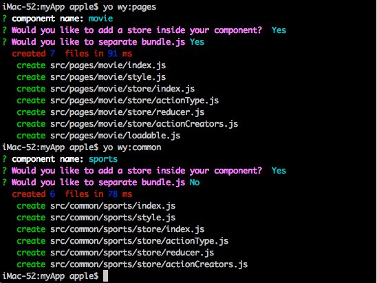

# generator-wy [![NPM version][npm-image]][npm-url] [![Build Status][travis-image]][travis-url] 
 
## what's `react-cli` for?
It's a cli for react, with which we can quickly build our react application.

## how to use?

### 1. installation

First, install [Yeoman](http://yeoman.io) and generator-wy using [npm](https://www.npmjs.com/) (we assume you have pre-installed [node.js](https://nodejs.org/)).

```bash
npm install -g yo
npm install -g generator-wy
```

### 2. build your project
Then cd to somewhere you like(here is desktop), then start to generate your new project with following commands:

```bash
yo wy

```

### 3. build react components
- `yo wy:common` will create a component inside the common folder. Normally, the common folder used to store the component many pages will use.
- `yo wy:pages` will create a component inside the pages folder. Just as you can imagin, this folder used to store page component.

cd to your project folder, run :
```bash
yo wy:common
yo wy:pages
```

 <br/>
 <br/>

## Warning
please download then cd the project folder, and run `npm link`. if you don't want to use it **please run `npm  unlink` in the project folder as well**. if you don't do like this, it'll cause some trouble.

### developement confilict
some files, such as filename `.gitignore` will be changed into .nmpignore, so aviod this fault. We suggest rename the files which was started with `.`, here we use `_`

## contact me
If you have any issue in using this cli, please write to me, will reply to you when available. My email is mbp98k@gmail.com

## License

MIT © [Scott Xiong](https://gitee.com/cortney/generator-generator)

[npm-image]: https://badge.fury.io/js/generator-wy.svg
[npm-url]: https://npmjs.org/package/generator-wy
[travis-image]: https://travis-ci.org/cortney-x/generator-wy.svg?branch=master
[travis-url]: https://travis-ci.org/cortney-x/generator-wy
[daviddm-image]: https://david-dm.org/cortney-x/generator-wy.svg?theme=shields.io
[daviddm-url]: https://david-dm.org/cortney-x/generator-wy

